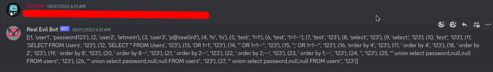

# SQL Injection Vulnerable Bot



This is a simple Python bot application vulnerable to SQL Injection attacks. The project consists of two main scripts: `create_db.py` and `bot.py`.

## Table of Contents

- [Introduction](#introduction)
- [Prerequisites](#prerequisites)
- [Setup](#setup)
- [Usage](#usage)
- [Security Warning](#security-warning)
- [Contributing](#contributing)
- [License](#license)

## Introduction

This project demonstrates a basic example of a bot application that is vulnerable to SQL Injection attacks. The application uses SQLite as its database and is designed for educational purposes to help understand the risks associated with improper input validation and handling in applications.

## Prerequisites

- Python 3.x
- SQLite

## Setup

1. Clone the repository:

   ```bash
   git clone https://github.com/yourusername/sql-injection-bot.git
```

2. Create the database using create_db.py:

```bash
python create_db.py

```
## Usage
Run the bot:
```bash
python3 bot.py
```

## Security Warning
This application intentionally contains vulnerabilities. It should only be used for educational purposes in controlled environments. Running this application in a production environment or on public networks can expose your system to security risks.

## Contributing
Contributions are welcome! If you find any issues or want to improve the project, feel free to submit a pull request.

## License
This project is licensed under the MIT License.


